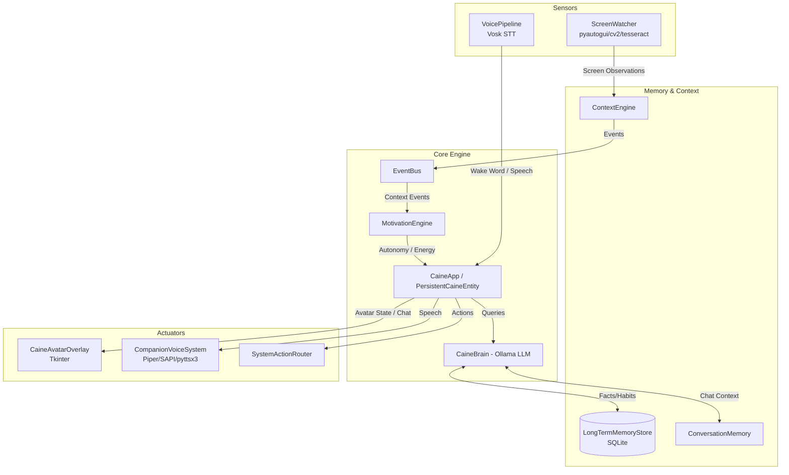

# CAINE SYSTEM REPORT

## 1. Architecture Diagram

## 2. Detected Components

### Sensors & Perception
- **ScreenWatcher (`screen_watcher.py`)**: Continuously captures screen frames using `pyautogui`, detects UI changes/new windows via `cv2`, and extracts text using `pytesseract`.
- **ContextEngine (`context_engine.py`)**: Uses `psutil` and Win32 `LASTINPUTINFO` to track active apps, focus duration, running processes, and user inactivity. Emits context events (`app_opened`, `game_detected`, etc.).
- **CompanionVoiceSystem (`voice_system.py`)**: Handles microphone listening via Vosk for wake word and command capture.

### Brain & Autonomy
- **CaineApp & PersistentCaineEntity (`main.py`, `caine/app.py`)**: The central orchestrator running background loops (World, Screen, Wake, Chat) and wiring event handlers.
- **DesktopCompanionBrain (`ai_brain.py`)**: High-level decision wrapper around `CaineBrain` (Ollama client). Evaluates screen changes and decides whether to react, reply to chat, or provide ambient presence.
- **MotivationEngine (`caine/core/motivation.py`)**: A pseudo-emotional state machine (boredom, curiosity, engagement, entertainment) updated by world events to dictate autonomous intervention thresholds and response style.

### Memory System
- **LongTermMemoryStore (`memory/long_term_memory.py`)**: SQLite-backed persistent memory tracking facts, preferences, user profile traits, habits, application focus time, and daily patterns.

### Outputs & Actions
- **CaineAvatarOverlay (`avatar/overlay.py`)**: A `tkinter`-based desktop overlay managing the Shimeji-style avatar state (sleep, listening, observing, speaking) and providing a visual chat terminal.
- **SystemActionRouter (`caine/app.py` -> `actions`)**: Controls the execution of commands and application launching, guarded by `config.yaml` permissions.
- **TTS Engine (`voice_system.py`)**: Synthesizes voice using Piper, SAPI, or pyttsx3.

## 3. Execution Pipeline

1. **Boot**: `main.py` initializes `PersistentCaineEntity`, loading `CaineConfig` from `config.yaml`. The local Ollama server is expected to be running.
2. **Background Loops**:
   - `_world_loop`: Samples `ContextEngine` every N seconds, updates `MotivationEngine`, and emits events via `EventBus`.
   - `_screen_loop`: `ScreenWatcher` observes UI changes. If a threshold is crossed, it asks `DesktopCompanionBrain` if a comment is necessary.
   - `_wake_loop`: Listens for the "hey caine" wake word. Once triggered, captures audio, translates to text, processes through LLM, and speaks the reply.
   - `_chat_loop`: Monitors the `CaineAvatarOverlay` terminal for direct text inputs.
3. **Autonomy Execution**: When an event fires (e.g., `user_focus_change`, `game_detected`), `MotivationEngine` evaluates the intervention threshold. If passed, CAINE formulates a prompt with the current world state, habits, and screen summary, querying Ollama for an autonomous remark.
4. **Action / Return to Sleep**: CAINE updates the avatar state (`speaking`, `excited`, etc.), delivers the TTS audio and text, and subsequently reverts to `sleep` state.

## 4. Problems Found

### Broken Dependencies (CRITICAL)
Running `verify_environment.py` reveals that the Python environment is completely lacking core dependencies required for sensors and outputs.
- **MISSING**: `requests`, `yaml`, `pyttsx3`, `pyautogui`, `sounddevice`, `vosk`, `openwakeword`, `cv2`, `pytesseract`, `PIL`, `speech_recognition`, `piper`.
- *Impact*: Voice STT/TTS, Screen Capture, OCR, and Image Processing will crash immediately upon execution.

### Other Observations
- `tesseract_cmd` is empty in `config.yaml`. OCR requires a valid Tesseract installation path.
- The `SystemActionRouter` references a `config.actions.workspace_root` of `.`, but commands like format/del are blacklisted as string matches, which can be bypassed.
- No isolation between multiple AI agents detected yet (if Antigravity is to co-exist, memory write locks on SQLite might occur).

## 5. Quick Wins

1. **Fix Python Environment**: Create and install a proper `requirements.txt` containing all missing libraries (`pip install -r requirements.txt`).
2. **Setup Tesseract OCR**: Install Tesseract on Windows and configure `config.yaml` to point to its executable.
3. **Configure Voice Models**: Ensure Vosk models (`models/vosk`) and Piper models (`assets/voices/piper`) are actually downloaded and present in the correct directories.

## 6. Next Evolution Steps

1. **System Health Enforcement**: Automatically install/verify missing dependencies or provide clear setup prompts on the very first boot.
2. **Multi-Agent Coordination Mechanism**: Add an intent-sharing layer or lock file system so CAINE and other agents do not talk over each other or conflict on screen events.
3. **Overlay Polish**: Port the `tkinter` overlay to something more modern and performant like PyQt or a transparent webview if the avatar animations become complex.
4. **Enhanced Screen Awareness**: Replace crude `cv2` diffing with a lightweight local vision model if hardware allows, or use Windows Accessibility APIs for more reliable text extraction than OCR.
